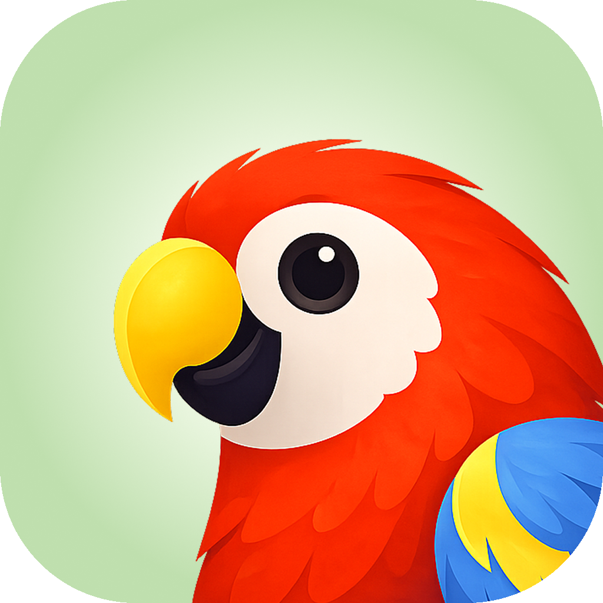
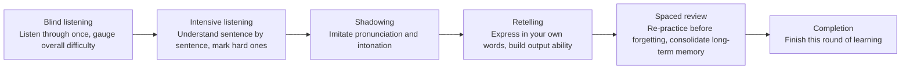

<div align="right">
  <strong>English</strong> | <a href="./README.md">简体中文</a>
</div>

<div align="center">
  

  <h1>Echo Loop — Efficient English Listening & Speaking Training</h1>

  <p><strong>You no longer have to figure out how to practice English on your own.</strong></p>

  <p>Blind listening · Intensive listening · Shadowing · Retelling · Review — Echo Loop guides you through every step at a scientifically-paced rhythm.</p>

  <p><sub><em>This project is academically advised by <a href="https://sfs.muc.edu.cn/info/1063/3729.htm"> Yang Yan</a> from the School of Foreign Studies, Minzu University of China.</em></sub></p>

  <p>
    <a href="./LICENSE"></a>
    
    <a href="https://github.com/echo-loop/Echo-Loop/releases/latest"></a>
    <a href="https://github.com/echo-loop/Echo-Loop/releases"></a>
    <a href="https://github.com/echo-loop/Echo-Loop/commits/main"></a>
  </p>

  <p>
    <a href="https://trendshift.io/repositories/41519" target="_blank"></a>
  </p>

  <p>
    <a href="https://apps.apple.com/app/id6760324074"></a>
    <a href="https://groups.google.com/u/0/g/echo-loop-testers/c/vzaTF9j4ys8"></a>
  </p>
</div>

> 🤖 **Note for Android users**: Echo Loop for Android is currently in a Google Play closed test. The Google Play button opens the tester invitation post. Please follow the post to join the Google Group first, then join the test and install the app.

> 🇨🇳 **Note for China users**: The China App Store listing is temporarily off the shelf while we complete ICP registration. Users in mainland China can still install Echo Loop with an App Store account from another region (e.g. US or Hong Kong). It will be relisted once registration is complete.

---

## 📱 Screenshots

<table>
  <tr>
    <td align="center"><br/><sub>Import audio, start practicing</sub></td>
    <td align="center"><br/><sub>Scientific practice, listen-speak loop</sub></td>
    <td align="center"><br/><sub>Auto reminders, visible progress</sub></td>
    <td align="center"><br/><sub>Sentence-by-sentence intensive listening</sub></td>
    <td align="center"><br/><sub>Sense-group split, hard sentence analysis</sub></td>
  </tr>
  <tr>
    <td align="center"><br/><sub>Retelling: turn comprehension into output</sub></td>
    <td align="center"><br/><sub>Saved hard sentences, practice to mastery</sub></td>
    <td align="center"><br/><sub>Flashcard review with original context</sub></td>
    <td align="center"><br/><sub>Practice freely at your own pace</sub></td>
    <td align="center"></td>
  </tr>
</table>

---

## ✨ Features

- 🤖 **Auto-driven learning rhythm**: Shadowing repetitions, review timing, and hard-sentence marking all advance automatically — you just focus on listening and speaking.
- 🎯 **Listen-speak loop**: Intensive listening, shadowing, and retelling flow seamlessly. From understanding the content, to imitating expression, to saying it in your own words.
- 🧩 **Sense-group splitting for long sentences**: Long sentences are split by sense groups, breaking complex structures into digestible chunks.
- ⭐ **Save hard sentences and review them on demand**: Hard sentences are auto-archived for focused shadowing and repeated practice — no more "marked and forgotten".
- 📚 **Contextualized flashcard review**: Saved words and sense groups are reviewed alongside their original sentence context — memorize in context, not in isolation.
- 💡 **AI translation, analysis, and vocabulary explanation**: Bilingual translation, sentence analysis, word usage and collocations — expand on demand without breaking your flow.
- 📍 **Resume where you left off**: Automatically records your stage and current sentence, so you can pick up instantly — even 5-minute fragments count.
- 📊 **Learning statistics**: Tracks practice time, input/output ratio, and unique vocabulary — see exactly how much you've practiced and spoken.
- 🎙️ **AI shadowing evaluation**: Automatically aligns ASR results with the original text, highlights matched words, and gives a shadowing rating.
- 🎧 **Local audio import + AI subtitles**: Batch-import local audio, import existing subtitles, or auto-transcribe with AI.

---

## 🤔 Why we built this

When using other English-learning apps, you have to decide for yourself: how many times should I listen today? Intensive or extensive? Which sentence haven't I mastered yet? Should I shadow it? When should I review?

**Those decisions themselves are what drains your willpower** — it's not that you can't understand, it's that you don't know what to do next.

Echo Loop takes those decisions off your plate. Pick a piece of audio you want to understand, hit start, and from blind listening to completion, every step tells you "what to do right now".

You just need to keep opening the app — Echo Loop handles the rest. Practicing one piece thoroughly beats listening to 100 random ones.

---

## 🆚 How it differs from other solutions

We picked four English-learning apps most familiar to Chinese learners for comparison. Each individual feature exists, more or less, in other apps. But Echo Loop's real difference is this: **it strings every step together and drives you through automatically — you don't need to figure out the method, control repetition counts, or manage review intervals yourself.**

| Feature | Echo Loop | Daily English Listening | Kekenet | Liulishuo | Anki |
|---|---|---|---|---|---|
| **App-driven learning rhythm** | ✅ Fully automatic | ❌ | ❌ | ❌ | ❌ |
| Listen → speak loop (intensive + shadowing + **retelling**) | ✅ | ⚠️ Partial | ⚠️ Partial | ⚠️ Partial | ❌ |
| **Sense-group splitting for long sentences** | ✅ | ❌ | ❌ | ❌ | ❌ |
| **Saved-sentence focused review** | ✅ | ❌ | ❌ | ❌ | ❌ |
| **Contextualized flashcard review** | ✅ | ❌ | ❌ | ❌ | ⚠️ Manual cards required |
| AI translation / sentence analysis / word deep-dive | ✅ | ⚠️ Partial | ⚠️ Partial | ❌ | ❌ |
| **Resume where you left off** | ✅ | ⚠️ Partial | ⚠️ Partial | ⚠️ Partial | ⚠️ Partial |
| Stats: time / input-output ratio / unique vocabulary | ✅ | ⚠️ Partial | ⚠️ Partial | ⚠️ Partial | ❌ |
| AI shadowing evaluation | ✅ | ✅ | ✅ | ✅ | ❌ |
| Local audio import | ✅ | ✅ | ❌ | ❌ | ⚠️ Manual cards |
| Offline available | ✅ | ✅ | ✅ | ⚠️ Partial | ✅ |
| Open source | ✅ | ❌ | ❌ | ❌ | ✅ |

---

## 🧠 Methodology

**Blind listening → Intensive listening → Shadowing → Retelling → Spaced review → Completion.**



**Every step above is auto-driven by Echo Loop — no judgment calls required.**

You don't need to manage "how many times should I listen" or "is it time to review last week's material". Open the app, and what to do today appears right in front of you.

The full process is quantified: **practice time · input/output ratio · unique vocabulary**.

<details>
<summary><strong>How are spaced reviews scheduled?</strong></summary>

Each piece of material is split into 1 first-pass session + 7 spaced reviews. Intervals stretch from 6 hours to 28 days, hitting the memory trace just before forgetting — aligned with the Ebbinghaus forgetting curve.

| Stage | Interval since last | Tasks |
|---|---|---|
| First pass | — | Blind → Intensive → Shadowing → Retelling |
| Review 1 | After 6 hours | Hard-sentence drills + retelling |
| Review 2 | After 1 day | Blind listening + drills + retelling |
| Review 3 | After 2 days | Blind listening + drills + retelling |
| Review 4 | After 4 days | Blind listening + drills + retelling |
| Review 5 | After 7 days | Blind listening + drills + retelling |
| Review 6 | After 14 days | Blind listening + drills + retelling |
| Review 7 | After 28 days | Blind listening + drills + retelling |

</details>

---

## 📥 Download & try it

<table>
  <tr>
    <td valign="middle">
      <p>
        <a href="https://apps.apple.com/app/id6760324074"></a>
        &nbsp;
        <a href="https://groups.google.com/u/0/g/echo-loop-testers/c/vzaTF9j4ys8"></a>
        &nbsp;
        <a href="https://github.com/echo-loop/Echo-Loop/releases"></a>
      </p>
      <p><sub>Echo Loop for Android is currently in a Google Play closed test. Click the Google Play button to open the tester invitation.</sub></p>
      <p><sub>Desktop: macOS in development · Windows planned · Web not planned</sub></p>
    </td>
    <td valign="middle" align="center" width="120">
      <br/>
      <sub>Scan to download iOS</sub>
    </td>
    <td valign="middle" align="center" width="120">
      <br/>
      <sub>Scan to download Android</sub>
    </td>
  </tr>
</table>

---

## 💬 Join the community

Practice English alongside other committed learners: share methods, give feedback, and be the first to hear about new features.

<table>
  <tr>
    <td valign="middle" align="center" width="140">
      <br/>
      <sub>Scan to join WeChat group</sub>
    </td>
    <td valign="middle">
      <p><sub>If the QR code expires or the group hits the 200-member cap, add WeChat <code>echo-loop-app</code> first and the admin will invite you in.</sub></p>
    </td>
  </tr>
</table>

---

## 🗺️ Roadmap

### ✅ 1 · Core features

- [x] Learning loop: blind / intensive / shadowing / retelling
- [x] Spaced review scheduling (6h → 28d)
- [x] Sense-group splitting for long sentences
- [x] Saved hard sentences + focused review
- [x] Contextualized flashcard review
- [x] AI translation / sentence analysis
- [x] iOS / macOS native ASR shadowing evaluation
- [x] Resume where you left off
- [x] Learning statistics

### 🚧 2 · AI capabilities

- [ ] AI speaking partner
- [ ] AI learning assistant (on-demand Q&A)
- [ ] Word deep-dive analysis
- [ ] Personalized material recommendations

### 🔭 3 · Experience & platforms

- [ ] Custom task flows
- [ ] Streaks / learning badges
- [ ] Official macOS / Windows desktop release

### 🔭 4 · Content ecosystem

- [ ] Official curated collections (by topic + difficulty)
- [ ] User-shared collections / UGC learning materials

---

## ⭐ Star History

[](https://star-history.com/#echo-loop/Echo-Loop&Date)

---

## 🎓 Academic guidance & acknowledgements

**Academic guidance**

Thanks to [Yang Yan](https://sfs.muc.edu.cn/info/1063/3729.htm) (School of Foreign Studies, Minzu University of China; PhD in English Language and Literature, Peking University) for guiding this project's methodology.

**Core dependencies**

- Audio & speech: [just_audio](https://pub.dev/packages/just_audio) · [audio_session](https://pub.dev/packages/audio_session) · [flutter_tts](https://pub.dev/packages/flutter_tts) · [sherpa_onnx](https://pub.dev/packages/sherpa_onnx)
- Data & state: [drift](https://pub.dev/packages/drift) · [flutter_riverpod](https://pub.dev/packages/flutter_riverpod)
- Text processing: [subtitle](https://pub.dev/packages/subtitle) · [lemmatizerx](https://pub.dev/packages/lemmatizerx)
- System capabilities: [file_picker](https://pub.dev/packages/file_picker) · [flutter_local_notifications](https://pub.dev/packages/flutter_local_notifications)

---

## 🧑‍💻 For developers

<details open>
<summary><strong>🚀 Quick start</strong></summary>

```bash
git clone git@github.com:echo-loop/Echo-Loop.git
cd Echo-Loop
cp .dev.env.template .dev.env   # fill in Supabase / Google / API base URL
flutter pub get
dart run build_runner build
flutter run -d <ios|android|macos> --dart-define-from-file=.dev.env
```

> Compile-time variables (`SUPABASE_URL`, `SUPABASE_PUBLISHABLE_KEY`, `GOOGLE_WEB_CLIENT_ID`, `API_BASE_URL`)
> live in `.dev.env` (debug) / `.prod.env` (release) and are injected via `--dart-define-from-file`.
> Both files are gitignored — do not commit them. `.prod.env` uses the same keys with the production `API_BASE_URL`.

</details>

<details>
<summary><strong>🤝 How to contribute</strong></summary>

Issues and PRs are welcome. Before submitting, please run:

```bash
flutter analyze
flutter test
```

Commit titles follow the `PREFIX: content` format (check `git log` for common prefixes — FEAT / FIX / DOCS / MOD / OPT / CHORE / CI / RELEASE, etc.). A detailed contribution guide will live in [CONTRIBUTING.md](#) (TBD). This project follows the [Contributor Covenant](https://www.contributor-covenant.org/) code of conduct.

</details>

<details>
<summary><strong>🛠️ Tech stack</strong></summary>


| Category | Technology | Purpose |
|------|------|------|
| UI framework | Flutter + Material 3 | Cross-platform UI |
| State management | Riverpod (code generation) | Unidirectional data flow |
| Audio playback | just_audio + audio_session | Audio engine layer |
| Subtitle parsing | subtitle | SRT/VTT |
| File picker | file_picker | Local audio/subtitle import |
| Persistence | Drift (SQLite) + shared_preferences | Progress, favorites, cache |
| i18n | flutter_localizations + ARB | 简体中文 / English |
| Testing | flutter_test + mocktail | Unit / widget / integration |
| Static analysis | flutter_lints | Code style |

</details>

<details>
<summary><strong>📁 Project structure</strong></summary>

```
lib/
├── l10n/              # i18n files (ARB format)
├── models/            # Data models (AudioItem, Sentence, Collection, etc.)
├── providers/         # Riverpod state management
│   ├── audio_engine/  # Audio engine layer (low-level playback control)
│   └── listening_practice/  # Listening practice layer (business logic)
│       ├── sentence_tracker.dart   # Sentence locator (binary search)
│       └── bookmark_manager.dart   # Bookmark manager
├── screens/           # Pages
├── services/          # Service layer (StorageService, SubtitleParser)
└── widgets/           # Reusable components

integration_test/      # End-to-end tests
test/                  # Unit / widget tests
```

</details>

<details>
<summary><strong>⌨️ Dev commands cheat sheet</strong></summary>

**Run**

```bash
flutter run -d ios            # iOS
flutter run -d android        # Android
flutter run -d macos          # macOS (in development, unreleased)
flutter run -d chrome         # Web (debug only, no release plan)

# iOS Simulator
xcrun simctl list devices available
xcrun simctl boot <DEVICE_UDID>
open -a Simulator
```

**Test / quality checks**

```bash
flutter analyze                          # Static analysis
flutter test                             # All tests
flutter test integration_test -d macos   # Integration tests
dart format .                            # Format
```

**Code generation** (after modifying Riverpod providers)

```bash
dart run build_runner build
```

**Build**

```bash
# Compile-time variables are injected from an env file (.dev.env for debug, .prod.env for release)
flutter build macos --dart-define-from-file=.prod.env
flutter build apk   --dart-define-from-file=.prod.env
flutter build ios   --dart-define-from-file=.prod.env

# Run on device
flutter run --release -d <DEVICE_ID> --dart-define-from-file=.dev.env
```

> The release scripts `scripts/run_simulator.sh` (reads `.dev.env`) and
> `scripts/release_{android,ios,macos}.sh` (read `.prod.env`) already pass
> `--dart-define-from-file` for you.

**Requirements**

- Flutter SDK 3.9.2+
- iOS Simulator / Android emulator / physical devices
- Desktop: macOS / Windows / Linux dev environment

</details>

---

## 📄 License

[AGPL-3.0](./LICENSE)
