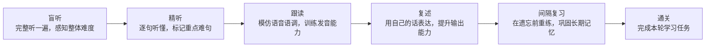

<div align="right">
  <a href="#">English</a> | <strong>简体中文</strong>
</div>

<div align="center">
  

  <h1>Echo Loop — 高效的英语听说训练 App</h1>

  <p><strong>从此不必自己摸索怎么练好英语。</strong></p>

  <p>盲听 · 精听 · 跟读 · 复述 · 复习，Echo Loop 按科学节奏推你走完。</p>

  <p><sub><em>本项目由中央民族大学外国语学院 <a href="https://sfs.muc.edu.cn/info/1063/3729.htm">杨艳老师</a> 指导设计。</em></sub></p>

  <p>
    <a href="./LICENSE"></a>
    
    <a href="https://github.com/echo-loop/Echo-Loop/commits/main"></a>
  </p>

  <p>
    <a href="https://apps.apple.com/cn/app/echo-loop-%E9%AB%98%E6%95%88%E8%8B%B1%E8%AF%AD%E5%90%AC%E8%AF%B4%E8%AE%AD%E7%BB%83/id6760324074"></a>
  </p>
</div>

---

## 📱 截图

<table>
  <tr>
    <td align="center"><br/><sub>导入音频，开始练习</sub></td>
    <td align="center"><br/><sub>科学练习，听说闭环</sub></td>
    <td align="center"><br/><sub>自动提醒，进步可见</sub></td>
    <td align="center"><br/><sub>逐句精听，难句标注</sub></td>
    <td align="center"><br/><sub>意群划分，难句解析</sub></td>
  </tr>
  <tr>
    <td align="center"><br/><sub>段落复述，听懂变成会说</sub></td>
    <td align="center"><br/><sub>难句收藏，熟中生巧</sub></td>
    <td align="center"><br/><sub>闪卡复习，原句再现</sub></td>
    <td align="center"><br/><sub>按你的节奏，自由练习</sub></td>
    <td align="center"></td>
  </tr>
</table>

---

## ✨ 功能

- 🤖 **自动驱动学习节奏**：跟读次数、复习时机、难句标记自动推进，你只需要专注听和说。
- 🎯 **听说闭环**：精听、跟读、复述一气呵成。从听懂内容，到模仿表达，再到用自己的话说出来。
- 🧩 **长难句意群划分**：长句按意群切分，复杂句拆开理解，降低听懂难度。
- ⭐ **难句收藏与专项复习**：难句自动归档，可集中跟读、反复重练，避免“标了就忘”。
- 📚 **语境化闪卡复习**：收藏单词和意群，结合原句上下文复习，在语境中记忆，而不是孤立背词。
- 💡 **AI 翻译、解析与词汇讲解**：支持双语翻译、句子解析、单词用法和搭配讲解，按需展开，不打断学习节奏。
- 📍 **断点续学**：自动记录学习阶段和当前句子，下次打开直接继续，5 分钟碎片时间也能练。
- 📊 **学习数据统计**：记录学习时长、输入输出比例、唯一词汇量，让练了多少、说了多少一目了然。
- 🎙️ **跟读 AI 评测**：自动对齐识别结果与原文，高亮命中词，并给出跟读评级。
- 🎧 **导入本地音频 + AI 字幕**：支持批量导入本地音频，可导入本地字幕，也可用 AI 自动转录生成字幕。

---

## 🤔 我们为什么做这个

用其它英语 App 学习时，你得自己决定：今天听几遍？是该精听还是泛听？哪句话还没掌握？要不要跟读？什么时候该复习？

**这些决策本身才是最消耗意志力的地方**：不是听不懂，是不知道下一步该做什么。

这些决策压力，Echo Loop 替你扛了。选一段你想听懂的音频，按下开始，从盲听到通关，每一步它都会告诉你"现在做什么"。

你只需要坚持打开 App，剩下交给 Echo Loop。把一段材料练透，强过泛听 100 个音频。

---

## 🆚 和其他方案的差异

挑了四款国内学习者最熟的 App 对比。单看每一项功能，其它 App 也或多或少有；但 Echo Loop 真正的不同在于：**它把每一步串起来自动驱动你走完，你不需要自己摸索方法、控制遍数、掌握复习节奏。**

| 功能 | Echo Loop | 每日英语听力 | 可可英语 | 英语流利说 | Anki |
|---|---|---|---|---|---|
| **学习节奏由 App 驱动** | ✅ 全自动 | ❌ | ❌ | ❌ | ❌ |
| 听 → 说闭环（精听 + 跟读 + **复述**） | ✅ | ⚠️ 部分支持 | ⚠️ 部分支持 | ⚠️ 部分支持 | ❌ |
| **长难句意群划分** | ✅ | ❌ | ❌ | ❌ | ❌ |
| **收藏句专项复习** | ✅ | ❌ | ❌ | ❌ | ❌ |
| **语境化闪卡复习** | ✅ | ❌ | ❌ | ❌ | ⚠️ 需手动建卡 |
| AI 翻译 / 句子解析 / 单词深度解析 | ✅ | ⚠️ 部分支持 | ⚠️ 部分支持 | ❌ | ❌ |
| **断点续学**| ✅ | ⚠️ 部分支持 | ⚠️ 部分支持 | ⚠️ 部分支持 | ⚠️ 部分支持 |
| 学习数据：时长 / 输入输出比 / 唯一词汇量 | ✅ | ⚠️ 部分支持 | ⚠️ 部分支持 | ⚠️ 部分支持 | ❌ |
| 跟读 AI 评测 | ✅ | ✅ | ✅ | ✅ | ❌ |
| 导入本地音频 | ✅ | ✅ | ❌ | ❌ | ⚠️ 需自制卡片 |
| 离线可用 | ✅ | ✅ | ✅ | ⚠️ 部分支持 | ✅ |
| 开源 | ✅ | ❌ | ❌ | ❌ | ✅ |

---

## 🧠 学习方法论

**盲听 → 精听 → 跟读 → 复述 → 科学间隔复习 → 通关。**



**以上每一步，由 Echo Loop 自动驱动，不需要你判断。**

你不需要管"现在该听几遍"、"上次那个素材该不该复习了"。打开 App，今天该做什么会直接呈现在你眼前。

学习全过程量化：**学习时长 · 输入输出比 · 唯一词汇量**。

<details>
<summary><strong>间隔复习法是怎么安排的？</strong></summary>

每段素材分成 1 次首次学习 + 7 轮间隔复习。间隔从 6 小时拉长到 28 天，让大脑在快要遗忘时重新触达记忆痕迹，符合艾宾浩斯遗忘曲线。

| 阶段 | 距上次间隔 | 任务 |
|---|---|---|
| 首次学习 | — | 盲听 → 精听 → 跟读 → 段落复述 |
| 首轮复习 | 6 小时后 | 难句补练 + 段落复述 |
| 第二轮复习 | 1 天后 | 盲听 + 难句补练 + 段落复述 |
| 第三轮复习 | 2 天后 | 盲听 + 难句补练 + 段落复述 |
| 第四轮复习 | 4 天后 | 盲听 + 难句补练 + 段落复述 |
| 第五轮复习 | 7 天后 | 盲听 + 难句补练 + 段落复述 |
| 第六轮复习 | 14 天后 | 盲听 + 难句补练 + 段落复述 |
| 第七轮复习 | 28 天后 | 盲听 + 难句补练 + 段落复述 |

</details>

---

## 🎬 Demo

<!-- TODO: 录制后替换 -->
<table>
  <tr>
    <td align="center"><br/><sub>跟读评测：原生 ASR + 命中词高亮</sub></td>
    <td align="center"><br/><sub>闪卡复习：原句上下文配翻转卡片</sub></td>
  </tr>
</table>

---

## 📥 下载与试用

<table>
  <tr>
    <td valign="middle">
      <p>
        <a href="https://apps.apple.com/cn/app/echo-loop-%E9%AB%98%E6%95%88%E8%8B%B1%E8%AF%AD%E5%90%AC%E8%AF%B4%E8%AE%AD%E7%BB%83/id6760324074"></a>
        &nbsp;
        <a href="https://github.com/echo-loop/Echo-Loop/releases"></a>
      </p>
      <p><sub>桌面端：macOS 开发中 · Windows 规划中 · Web 暂无计划</sub></p>
    </td>
    <td valign="middle" align="center" width="140">
      <br/>
      <sub>扫码下载 iOS 版</sub>
    </td>
  </tr>
</table>

---

## 💬 加入社群

和其他认真练英语的伙伴一起：交流学习方法、反馈使用体验、第一时间收到新功能更新。

<table>
  <tr>
    <td valign="middle" align="center" width="140">
      <br/>
      <sub>扫码加入微信群</sub>
    </td>
    <td valign="middle">
      <p><sub>二维码过期或群已满 200 人后请先加微信 <code>echo-loop-app</code>，由群主拉你进群。</sub></p>
    </td>
  </tr>
</table>

---

## 🗺️ Roadmap

### ✅ 1 · 核心功能

- [x] 学习闭环：盲听 / 精听 / 跟读 / 段落复述
- [x] 间隔复习调度（6h → 28d）
- [x] 长难句意群划分
- [x] 难句收藏 + 专项复习
- [x] 语境化闪卡复习
- [x] AI 翻译 / 句子解析
- [x] iOS / macOS 原生 ASR 跟读评测
- [x] 断点续学
- [x] 学习数据统计

### 🚧 2 · AI 能力

- [ ] AI 口语陪练
- [ ] AI 学习助手（随时答疑）
- [ ] 单词深度解析
- [ ] 个性化素材推荐

### 🔭 3 · 体验与平台

- [ ] 自定义任务流
- [ ] 连胜激励 / 学习勋章
- [ ] macOS / Windows 桌面版正式发布

### 🔭 4 · 内容生态

- [ ] 官方精选合集（按主题 + 难度分级）
- [ ] 用户合集分享 / UGC 学习材料

---

## ⭐ Star History

[](https://star-history.com/#echo-loop/Echo-Loop&Date)

---

## 🎓 学术指导 & 致谢

**学术指导**

感谢 [杨艳老师](https://sfs.muc.edu.cn/info/1063/3729.htm)（中央民族大学外国语学院；北京大学英语语言文学博士）对本项目方法论的指导。

**核心依赖**

- 音频与语音：[just_audio](https://pub.dev/packages/just_audio) · [audio_session](https://pub.dev/packages/audio_session) · [flutter_tts](https://pub.dev/packages/flutter_tts) · [sherpa_onnx](https://pub.dev/packages/sherpa_onnx)
- 数据与状态：[drift](https://pub.dev/packages/drift) · [flutter_riverpod](https://pub.dev/packages/flutter_riverpod)
- 文本处理：[subtitle](https://pub.dev/packages/subtitle) · [lemmatizerx](https://pub.dev/packages/lemmatizerx)
- 系统能力：[file_picker](https://pub.dev/packages/file_picker) · [flutter_local_notifications](https://pub.dev/packages/flutter_local_notifications)

---

## 🧑‍💻 给开发者

<details open>
<summary><strong>🚀 快速开始</strong></summary>

```bash
git clone git@github.com:echo-loop/Echo-Loop.git
cd Echo-Loop
flutter pub get
dart run build_runner build
flutter run -d <ios|android|macos>
```

</details>

<details>
<summary><strong>🤝 如何贡献</strong></summary>

欢迎提 Issue / PR。提交前请运行：

```bash
flutter analyze
flutter test
```

Commit 标题遵循 `PREFIX: 内容` 格式（参考 `git log` 看常用前缀，如 FEAT / FIX / DOCS / MOD / OPT / CHORE / CI / RELEASE 等）。详细贡献流程见 [CONTRIBUTING.md](#)（待补）。本项目遵循 [Contributor Covenant](https://www.contributor-covenant.org/) 行为准则。

</details>

<details>
<summary><strong>🛠️ 技术栈</strong></summary>


| 类别 | 技术 | 用途 |
|------|------|------|
| UI 框架 | Flutter + Material 3 | 跨平台 UI |
| 状态管理 | Riverpod（代码生成） | 单向数据流 |
| 音频播放 | just_audio + audio_session | 音频引擎层 |
| 字幕解析 | subtitle | SRT/VTT |
| 文件选择 | file_picker | 本地音频/字幕导入 |
| 数据持久化 | Drift (SQLite) + shared_preferences | 学习进度、收藏、缓存 |
| 国际化 | flutter_localizations + ARB | 简体中文 / English |
| 测试 | flutter_test + mocktail | 单元 / Widget / 集成 |
| 静态分析 | flutter_lints | 代码规范 |

</details>

<details>
<summary><strong>📁 项目结构</strong></summary>

```
lib/
├── l10n/              # 国际化翻译文件（ARB 格式）
├── models/            # 数据模型（AudioItem, Sentence, Collection 等）
├── providers/         # Riverpod 状态管理
│   ├── audio_engine/  # 音频引擎层（底层播放控制）
│   └── listening_practice/  # 听力练习层（业务逻辑）
│       ├── sentence_tracker.dart   # 句子定位（二分查找）
│       └── bookmark_manager.dart   # 书签管理
├── screens/           # 页面
├── services/          # 服务层（StorageService, SubtitleParser）
└── widgets/           # 可复用组件

integration_test/      # 端到端测试
test/                  # 单元 / Widget 测试
```

</details>

<details>
<summary><strong>⌨️ 开发命令速查</strong></summary>

**运行**

```bash
flutter run -d ios            # iOS
flutter run -d android        # Android
flutter run -d macos          # macOS（开发中，未发布）
flutter run -d chrome         # Web（仅调试用，无发布计划）

# iOS 模拟器
xcrun simctl list devices available
xcrun simctl boot <DEVICE_UDID>
open -a Simulator
```

**测试 / 质量检查**

```bash
flutter analyze                          # 静态分析
flutter test                             # 全部测试
flutter test integration_test -d macos   # 集成测试
dart format .                            # 格式化
```

**代码生成**（修改 Riverpod Provider 后）

```bash
dart run build_runner build
```

**构建**

```bash
flutter build macos
flutter build apk
flutter build ios

# 指定 API 地址
flutter build macos --dart-define=API_BASE_URL=https://dev.echo-loop.top
flutter build ios   --dart-define=API_BASE_URL=https://www.echo-loop.top

# 真机运行（指定 API 地址）
flutter run --release -d <DEVICE_ID> --dart-define=API_BASE_URL=https://dev.echo-loop.top
```

**环境要求**

- Flutter SDK 3.9.2+
- iOS 模拟器 / Android 模拟器 / 真机
- 桌面端：macOS / Windows / Linux 开发环境

</details>

---

## 📄 License

[AGPL-3.0](./LICENSE)
